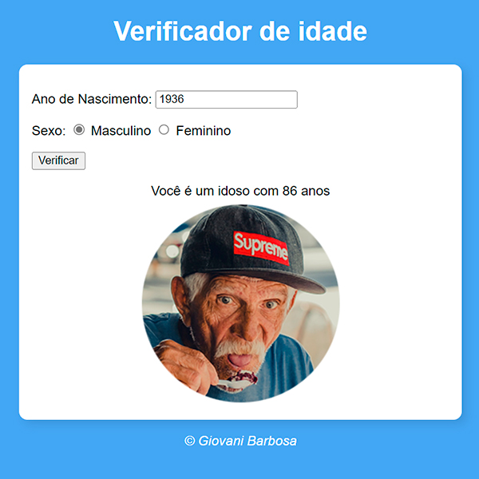

# Identificador de persona por idade e gênero
[Clique para acessar o programa]()

## Overview
### O projeto
O programa identifica sua persona por idade e gênero.
Basta informar seu ano de nascimento e sexo para verificar sua categoria.
Desafio vocês a colocar o ano de nascimento bem antigo para ver o resultado, pois trabalhei pensando no erro do usuário caso informe ano de nascimento inválido ou idade maior que a pessoa mais velha do mundo.

### Screenshot

## Meu processo
### Construção
- Criação da estrutura base do projeto (pastas, arquivos e fotos);
- Criação do HTML e sua estrutura;
- Link dos arquivos CSS (style);
- Criação do script JavaScript;
- Adicionando evento de click para interação com a página;
- Trabalho com testes booleanos e if, else, else if.
- Adicionando imagens de forma dinâmica conforme a idade e gênero informado.

### O que eu aprendi
Aprendi a adicionar imagens de forma dinâmica no JS, e pensar no erro dos usuários invalidando as informações incorretas que eles podem realizar.

## Programas utilizados
- Photoshop
- HTML5
- CSS
- JavaScript 